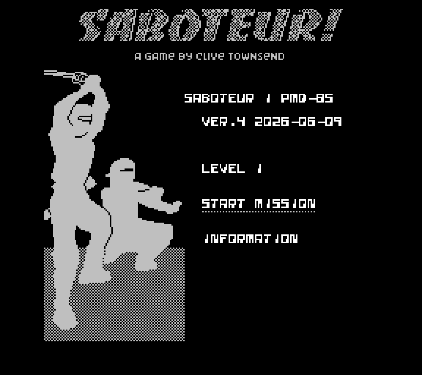
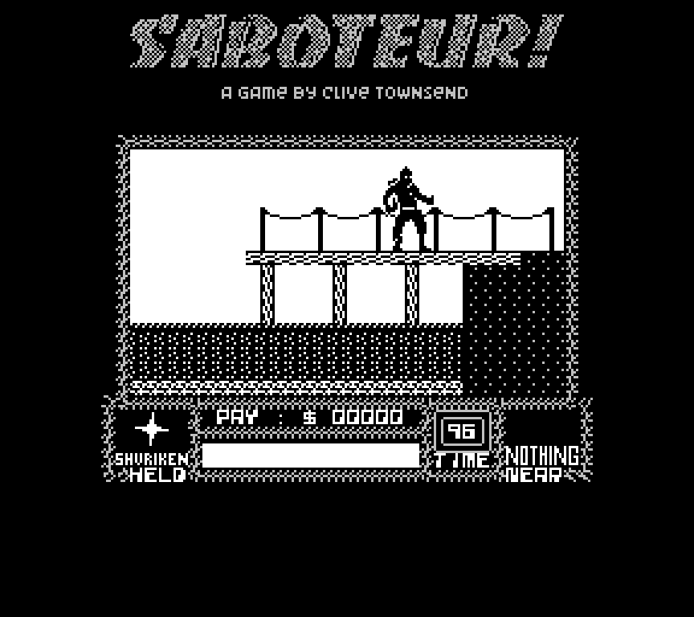

# pmd85-saboteur1
Porting **Saboteur** game from ZX Spectrum to PMD-85 computer.

Porting status: Work In Progress.

Screenshots of the ported version:

Controls:
 - Up/Down: <kbd>Q</kbd> / <kbd>A</kbd>
 - Left: <kbd><</kbd> <kbd>O</kbd> <kbd>9</kbd>
 - Right: <kbd>></kbd> <kbd>P</kbd> <kbd>0</kbd>
 - Fire: <kbd>Space</kbd>

Features of this version of Saboteur:
 - The game screen is reduced: the same number of tiles 30x17, but the tile size was 8x8 and became 6x6, thus the entire game screen 192x144 pixels. I did this to adapt to the PMD-85 screen and not lose performance.
 - Black/gray/white only, no colors
 - The code/data fits into 32K of RAM

## Tools used

 - `sjasmplus` cross-assembler
   https://github.com/z00m128/sjasmplus

 - RT-TEAM utilities like `quido`, `makepsn`, `bin2ptp`

 - PMD-85 emulator: I don't have the physical machine itself, so I'm only testing on the emulator.

